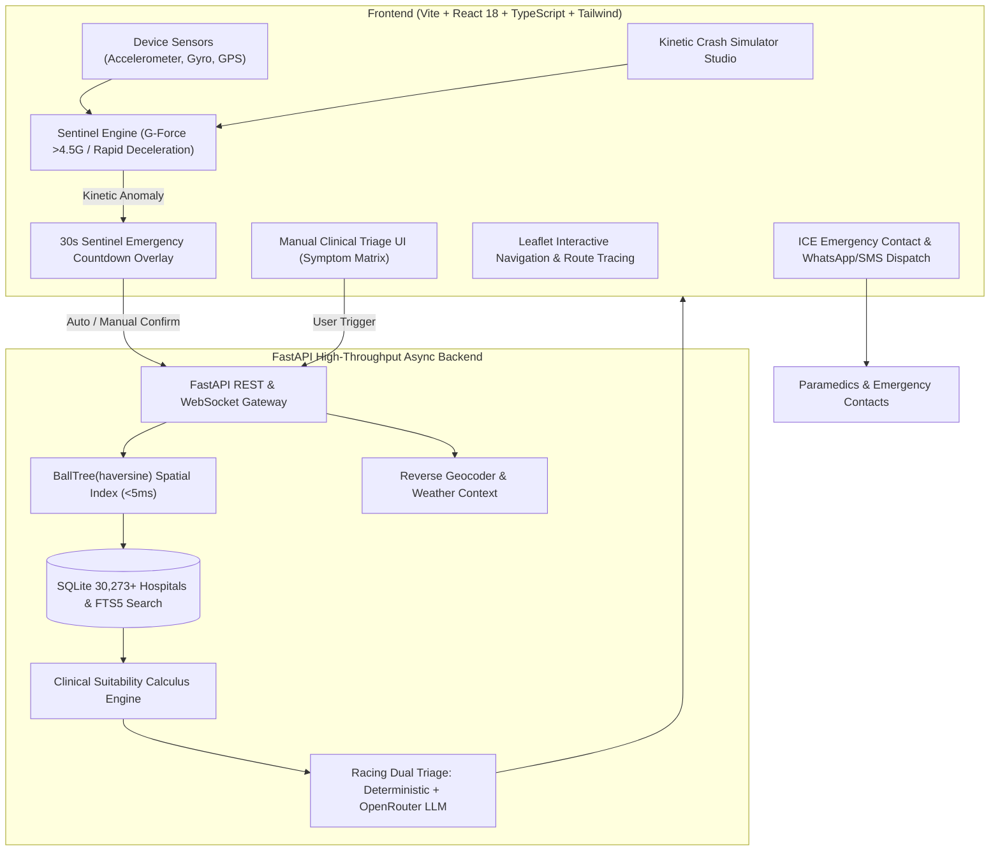

# 🚨 RoadSOS — Autonomous & Clinical Emergency Decision Intelligence

<div align="center">

[](https://fastapi.tiangolo.com)
[](https://reactjs.org)
[](https://www.typescriptlang.org)
[](https://tailwindcss.com)
[](https://vercel.com)
[](LICENSE)

**A mission-critical emergency triage and autonomous crash detection platform designed to eliminate fatal delays during the "Golden Hour" of transit accidents and trauma.**

[Live Architecture](#-architecture--system-flow) • [Sentinel Engine](#-sentinel-autonomous-mode) • [Clinical Calculus](#-clinical-suitability-calculus) • [Vercel Deployment](#-vercel-deployment) • [Local Setup](#-quick-start)

</div>

---

## 🌟 Executive Overview

During road accidents, high-speed collisions, and sudden cardiac or neuro-trauma events, **minutes decide between life and death**. Traditional emergency responses suffer from two fatal vulnerabilities:
1. **Unconscious Victims**: High-G kinetic collisions render occupants unconscious, unable to dial for help.
2. **Sub-Optimal Hospital Routing**: Patients are often rushed to the closest clinic rather than the nearest facility with verified Trauma Surgery, ICU, Ventilators, Cath Lab, or Blood Bank capabilities.

**RoadSOS** solves this with a **Dual-Engine Emergency Architecture**:
- **Sentinel Omniscient Engine (Autonomous Mode)**: 60Hz real-time kinetic physics engine detecting severe impacts ($>4.5\text{G}$), sudden deceleration ($>35\text{ km/h} \to 0$), and rollovers with a 30-second auditory-haptic override countdown that automatically broadcasts GPS telemetry if un-cancelled.
- **Clinical Triage SOS (Manual Mode)**: 1-tap instant emergency trigger or categorized clinical symptom matrix (Cardiac Arrest, Stroke FAST, Severe Burn, Hemorrhage, Pediatric Trauma).
- **Spatial BallTree & Clinical Calculus**: Spherical haversine search across **30,273+ national hospitals** (National Hospital Directory from data.gov.in) ranking facilities by clinical capability match, bed capacity, and trauma tier.
- **Dual Racing AI Triage**: Sub-10ms deterministic clinical rule engine racing with OpenRouter neural models (DeepSeek V3 / Claude 3.5) for step-by-step first aid stabilization.

---

## 🏗️ Architecture & System Flow



---

## ⚡ Key Engineering Innovations

### 1. 🛡️ Sentinel Autonomous Physics Engine
- Continuous 60Hz monitoring via `LinearAccelerationSensor` and `devicemotion`.
- Kinetic threshold: $G_{\text{force}} = \frac{\sqrt{x^2 + y^2 + z^2}}{9.80665} > 4.5\text{G}$.
- Deceleration threshold: $\Delta v > 30\text{ km/h}$ in $<1.5\text{s}$.
- Rollover tilt threshold: $\theta_{\text{tilt}} > 65^\circ$.
- Audio siren pulse synthesis via Web Audio API and Morse code SOS vibration via Web Vibration API.
- Integrated **Kinetic Simulation Studio** allowing live testing on desktop and mobile browsers.

### 2. 🏥 Spatial BallTree & Clinical Suitability Calculus
Physical proximity alone can be fatal if the nearest center lacks neurosurgery or an active blood bank. RoadSOS computes:
$$\text{Score} = 50.0 + S_{\text{specialties}} + S_{\text{facilities}} + S_{\text{tier}} + S_{\text{beds}} + S_{\text{emergency}} - (1.5 \times D_{\text{km}})$$

Where:
- **Specialty match**: $+15.0$ per symptom-to-specialty match.
- **Critical facilities** (ICU, Trauma Center, Cath Lab, Blood Bank, Ventilator): $+8.0 \to +20.0$ each.
- **Apex Tertiary / Medical College Tier**: $+30.0$.
- **High Bed Capacity** ($>500$ beds): $+20.0$.
- **24/7 Verified Emergency**: $+15.0$.

### 3. 🧠 Dual-Engine AI Triage Racing
- **Deterministic Engine**: Sub-10ms instantaneous clinical guidance based on standardized trauma resuscitation protocols.
- **OpenRouter Neural Engine**: Asynchronously queries DeepSeek V3 / Claude 3.5 for patient-specific clinical reasoning and interactive first-aid stabilization checklists.
- Total response time guaranteed $<3.5\text{s}$ under all network conditions.

---

## 🚀 Vercel Deployment

Deploy RoadSOS directly to Vercel with zero configuration:

```bash
# 1. Install Vercel CLI if not already installed
npm i -g vercel

# 2. Deploy from project root
vercel --prod
```

The repository includes:
- [`vercel.json`](file:///c:/Users/datha/OneDrive/Desktop/ROS%20project/vercel.json): Configured for Vite SPA build and serverless Python `/api` routing.
- [`api/index.py`](file:///c:/Users/datha/OneDrive/Desktop/ROS%20project/api/index.py): Serverless FastAPI entrypoint.
- Embedded offline-first fail-safe client dataset for instant edge execution.

---

## 💻 Quick Start (Local Development)

### Prerequisites
- Python 3.10+ (or [uv](https://github.com/astral-sh/uv))
- Node.js 18+ and npm

### 1. Clone & Configure
```bash
git clone https://github.com/dathasaiswaroopgudimella-png/RSOS.git
cd RSOS
cp .env.example .env
```

### 2. Backend Setup
```bash
# Install Python dependencies and build spatial database
uv sync
uv run python scripts/build_hospital_db.py

# Run FastAPI backend
uv run uvicorn backend.main:app --host 127.0.0.1 --port 8000 --reload
```

### 3. Frontend Setup
```bash
cd frontend
npm install
npm run dev
```

Visit `http://localhost:5173` to access the application.

---

## 🧪 Test Suite

Run automated unit and integration tests:

```bash
# Backend pytest suite (spatial BallTree, clinical calculus, triage racing, endpoints)
uv run pytest -v
```

---

## 📄 License
MIT License. Built for life-saving emergency response.
